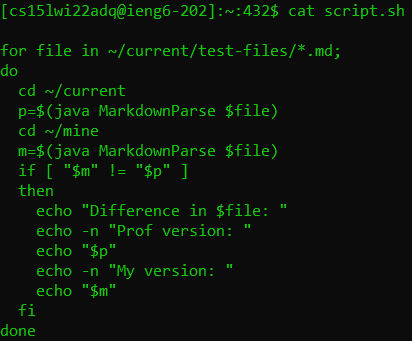
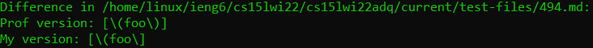
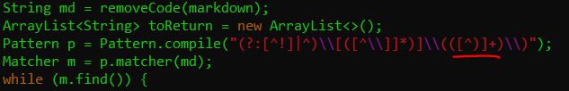
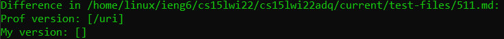
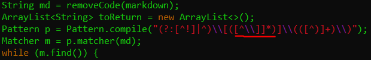

<style>pre{white-space:pre-wrap;} h1 code{font-size: 0.9em; padding: 5px;} code{padding: 3px;color:rgb(250,70,20);}</style>

# Identifying Bugs 
### But not fixing them

## Identifying differences
I used a script that runs my markdown parse program as well as the professor's program and prints their outputs if they are different:



```bash
for file in ~/current/test-files/*.md;
do
  cd ~/current
  p=$(java MarkdownParse $file)
  cd ~/mine
  m=$(java MarkdownParse $file)
  if [ "$m" != "$p" ]
  then
    echo "Difference in $file: "
    echo -n "Prof version: "
    echo "$p"
    echo -n "My version: "
    echo "$m"
  fi
done
```
Where the professor's code is in the `current` directory with a `test-files` subdirectory containing the test files, and my code is in the `mine` directory.

If the output is redirected into a file, it can easily be browsed later with the `less` command

## First test

Test file `494.md` contents:
```md
[link](\(foo\))
```
The professor's program's output is correct in this case since the link text should include both backslashes and both parenthesis while my program stops after the first backslash when it encounters the parenthesis.

Bug location:



The underlined section shows the bug in the regex, where it only checks for a parenthesis to close out the link and not an escaped parenthesis. The regex in question: `[^)]+` matches any character but `)` one or more times. It doesn't account for a backslash before the parenthesis, so it fails to include the escape parenthesis in the detected link.

## Second test

In this case, the professor's program is correct again while mine fails. This is because there are nested brackets included in the program which my code doesn't check for.

Bug Location:



The underlined section shows a different part of the regex that fails. This is because the regex doesn't account for matching groups of brackets inside the link and exits after the first one if it can't find a parenthesis after the first closing bracket it sees. This could be fixed by preprocessing with non-regex code to see if the first part of a link is valid. And then using a modified regex later. Otherwise, just using the CommonMark library would probably be best here.