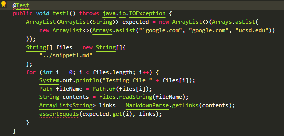
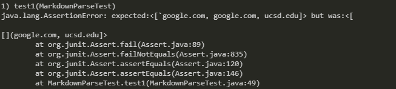
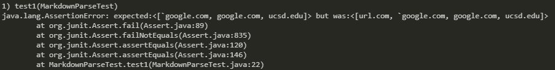
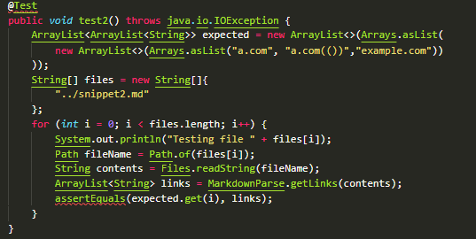
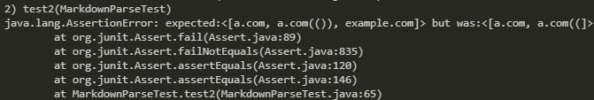
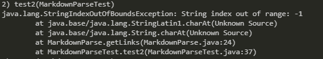
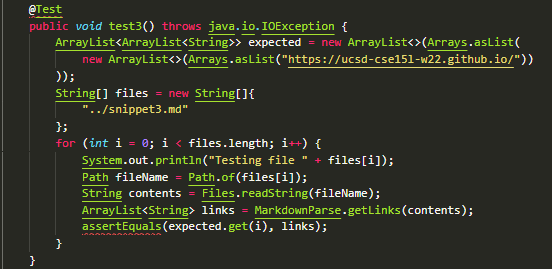
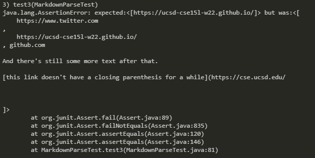
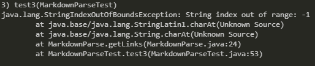

<style>pre{white-space:pre-wrap;} h1 code{font-size: 0.9em; padding: 5px;} code{padding: 3px;color:rgb(250,70,20);}</style>

# Debugging A Markdown Link Parser
### An ongoing example of why you should never try to build your own parser for a well-documented markup language when libraries already exist to parse it for you.

Today [my repository](https://github.com/Nicholas264/markdown-parse) will be facing off against [this person's respository](https://github.com/TheZenMasterz/markdown-parse) in an epic battle of who can build the best failing markdown link parser.

*Expected output is found by examining output from the [commonmark spec parser](https://spec.commonmark.org/dingus/)*

## Test 1
```
`[a link`](url.com)

[another link](`google.com)`

[`cod[e`](google.com)

[`code]`](ucsd.edu)
```
```
Expected result: ["`google.com", "google.com", "ucsd.edu"]
```
I designed these tests as one method first but repurposed it later to fit the lab spec sheet in the lowest effort way possible, so have fun looking at this needlessly complex code.



My failing test:



Rival's failing test:



## Test 2
```
[a [nested link](a.com)](b.com)

[a nested parenthesized url](a.com(()))

[some escaped \[ brackets \]](example.com)
```
```
Expected result: ["a.com", "a.com(())", "example.com"]
```
Here we go again!



My failing test:



Rival's failing test:



## Test 3
```
[this title text is really long and takes up more than 
one line

and has some line breaks](
    https://www.twitter.com
)

[this title text is really long and takes up more than 
one line](
    https://ucsd-cse15l-w22.github.io/
)


[this link doesn't have a closing parenthesis](github.com

And there's still some more text after that.

[this link doesn't have a closing parenthesis for a while](https://cse.ucsd.edu/


)

And then there's more text
```
```
Expected result: ["https://ucsd-cse15l-w22.github.io/"]
```
Huh, these test files seem like they were specifically designed to make our programs fail.



My failing test:



Rival's failing test:



## Conclusion

Is there a reasonable way to fix the issues these test cases go over? To the new programmer, the answer would probably be a resounding yes. Upon looking deeper into the commonmark spec and all of the edge cases you would need to cover, most of these test cases are unsolvable unless you build an entire markdown parser just to get the links.

### Test 1 Solution
Barring the arbitrary measurement of lines, there is no simple solution to solving all related cases to this test. This is because there can be an arbitrary amount of backticks that can be used to form a code sequence, there is many many priority rules for deciding whether a backtick is rendered or a part of some other style. In order to know if a backtick is a part of a link or not, or if backticks are preventing something from being a link, it is likely that you would need a nearly complete or complete markdown parser to solve it in this case.

### Test 2 Solution
This test is unique in that its cases seem like they are easy to solve with my version of the markdown-parser code. Using regex, I can allow escaped brackets, and I can repurpose my current backtick removing code to work with parenthesis and brackets. This could get complicated quite quickly though, but as long as the test isn't extended to include escaped backslashes and... Well you know, I take it back. This one is also too complex to solve in less than 10 lines unless you purposefully minfied your code and golfed it to fit on very few lines. Just like before, due to the sheer number of edge cases that can arise when using a custom build solution, a full fledged parser is necessary.

### Test 3 Solution
This test is easily solvable for the test cases given, but otherwise it will quickly balloon out of scope once all other features of markdown are introduced. I sound like a broken record by this point. However, I do believe that you could solve this one by just checking for double newlines inside of the parenthesis or brackets and not including any would-be links that match besides this. This is one solution that, if isolated to the small issue of newlines inside links, could be solvable in under 10 lines.

Drink your milk and never try this at home to avoid unbearable pain (unless you're into that).