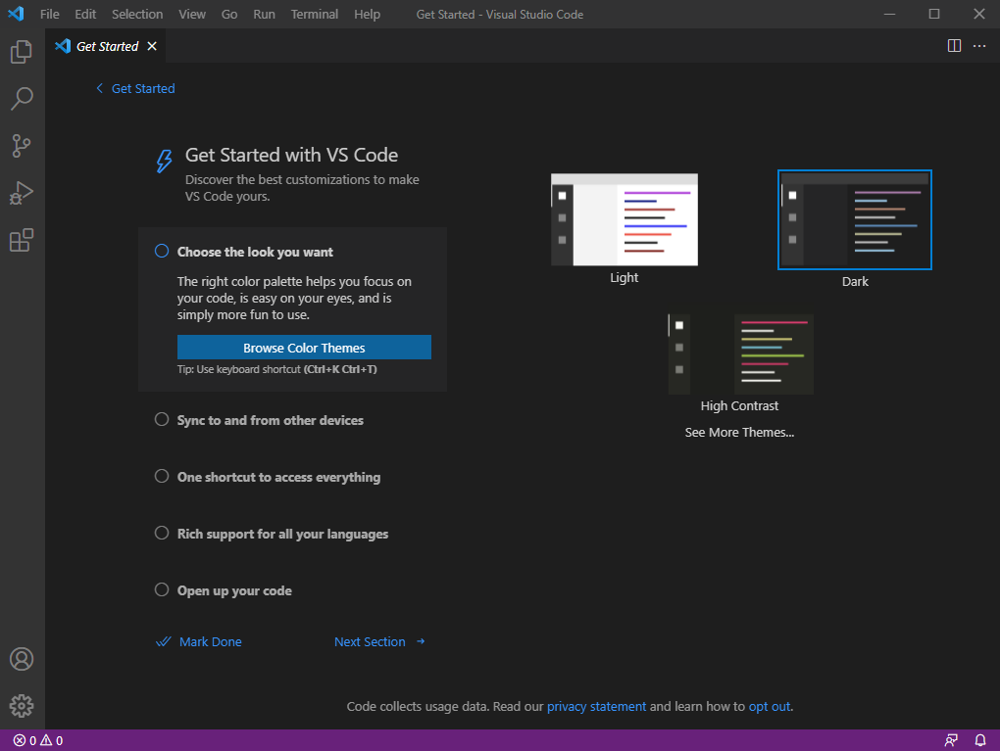

<style>pre{white-space:pre-wrap;} h1 code{font-size: 0.9em; padding: 5px;} code{padding: 3px;}</style>

# Remote Access to UCSD `ieng6` Machines
This document outlines the steps you need to take in order to get access to any course specific account on the `ieng6` computers at UCSD. 
## Setting up your computer
### Installing an SSH client
In order to connect, you're going to need an ssh client. Users on Windows machines can choose from a variety of SSH clients, but in this case we're going to be using [OpenSSH](https://www.openssh.com/). Users on Linux machines don't have to worry about this step since nearly all versions of Linux come prepackaged with an `ssh` command. In the case that your distro doesn't have it preinstalled, use your package manager to install it. Or, if you're using a really custom distro, build it from source.
### Installing VSCode
Simply head to the [VS Code Download Page](https://code.visualstudio.com/download) and install the latest version. The default configuration should be just fine.

This is how it looks when you have correctly installed and ran the program:


## Activating your account
If you're just starting the course, you're going to need to [set a password](https://sdacs.ucsd.edu/~icc/index.php) that you'll use to log in to your course account. Find your account by filling out the account lookup form.


You should have an account available for the course you are currently taking.


Then click on the change password link


Then follow through with the rest of the login prompts until you have to input a new password. This will be the new password you will use to log into `ieng6` computers (and everything else UCSD related).
## Connecting to the server
With an ssh client installed on your computer, you can start up a terminal or command prompt and type the following to connect to your new account.
```
ssh YOUR_USERNAME_HERE@ieng6.ucsd.edu

# In my case, the command would be 

ssh cs15lwi22adq@ieng6.ucsd.edu

# since my username is cs15lwi22adq
# For you, the username will be different on a course-by-course basis
```
Once you press the `Enter` key, you will be prompted to enter your new password.


Type your password in (the characters won't show up in the terminal while you're typing) and after pressing `Enter` again (assuming you typed the password correctly) you should see the above output in your terminal.

Congratulations, you have successfully logged in!
## Running commands on the server 
Assuming that you are not already an expert on linux commands, here are the bare essentials you need to know to get around the server:
- `ls` - Lists the files in the current directory
	- `ls -a` - Lists all files including hidden ones (unless they're really hidden)
	- `ls [directory name]` - Lists the specified directory
- `cd [new directory]` - Changes your directory to the new specified directory
	- `cd ..` - change to the parent directory of the one you're in
- `pwd` - Prints the absolute path of the directory you are currently in (just in case your eyes can't look slightly to the left of your cursor, or if you need to see the full expanded file path)
- `rm [filepath]` - Deletes the specified file
	- `rm -rf [filepath]` - is especially useful for particularly hard-to-get-rid-of files
- `touch [filepath]` - Makes a new empty file with the specified name
- `mkdir [directory path]` - Makes a new empty directory with the specified name
- `vim [filepath]` - Opens a file for editing and saving (just pretend emacs and nano don't exist)
- `chmod +x [filepath]` - Makes a specified file executable so that you can run it (used especially with bash scripts)
- `cat [file]` - Print the contents of a file
- `clear` - Clears your screen (but not your command history)
- `help` - Spits out a list of commands you can use
- `kill -9 [process id]` - Force kill a process by its id
- `ps` - Shows a list of your processes and their pids
- `mv [source] [dest]` - Moves a file from the source to the destination (can rename a file if you just put destination as the new name)
- `cp [source] [dest]` - Copies a file from the source to the destination

And most importantly remember to be `nice` to other users working on the same server as you. If you have a long-running, cpu-intensive task, be sure to start it with a higher nice value so it doesn't impact other users as much on the same system.
```
# 19 is the lowest priority, -20 is the highest, 0 is the default

nice -n 19 bash long_running_cpu_intensive_task.sh
```
You can play around with commands for a while until you get bored


Now that you're a linux master, it's time to move on to actually doing something stubstantial.
## Copying files from your computer to the server
With OpenSSH installed, you also have access to a command named `scp` which stands for "secure copy" (no, not a foundation that contains eldritch horrors). It's usage is as simple as:
```
scp [...source files] [remote server]
```
The only caveat is that in order to get it to work, you have to specify the directory on the server to place the files.
```
scp file.txt cs15lwi22adq@ieng6.ucsd.edu:~/

# See how the name of the server is separated from the destination directory by a colon? That is necessary for scp to recognize the destination as a remote server.
```


The image shows copying two files from my local computer to the remote server. If you look closely, you can also see a new way to use the `ssh` command. If you put an argument after specifying the server, `ssh` will log in and run that one command before logging out. This is convenient if you just need to check one thing, such as if your files were successfully transferred. You can specify multiple commands, but only if they are quoted and separated by semicolons.
```
# Prints contents of home directory, ascends a directory, and prints the parent directory contents

scp file.txt cse15lwi22adq@ieng6.ucsd.edu:~/ "ls; cd ..; ls"
```
## Setting up an SSH key
If you've been following along, it's probably been relatively tedious to keep inputting your password over and over again running commands like `scp` and `ssh`. Luckily there is a fix for this: SSH keys. With OpenSSH installed, you can use `ssh-keygen` to create a new public and private key to your server:
```
ssh-keygen -b 8192

# Make sure to use 8192 bits for your key just in case the NSA has found a way to break 4096 bit or 2048 bit RSA; you wouldn't want them to get a glimpse of your groundbreaking java code
```
Once running this command you'll be prompted to enter a file in which to save the key.


When it asks for a password, you can either leave it blank and hope no malicious individuals get ahold of the drive it's on (lest they have unfettered access to your account), or you can password protect it at the expense of efficiency. At the end of the day it's your choice between security and convenience.

Regardless, it's now time to put the key on the server so that you can actually log in with it. To do this, you'll make a new directory in your home folder called `.ssh` and place your public key (the one that begins with `ssh-rsa`) into the folder and name it `authorized_keys`.


Now that you've put your public key into the `authorized_keys` file, you'll now be able to use it to log-in to your server.


Using your private key for the identity file argument (`-i`), you are now able to log-in without inputting your password.
## Further optimizations
To make remote building in VSCode quicker, you can use keybinds along with scripts to optimize everything to the point at which it seems that it's running locally.


This script copies my local java file to the server, compiles it there, and then runs it. It also prints the working directory to prove that it's actually running on the server.


It runs when you press `Ctrl`+`Shift`+`B`, and its fast execution time saves minutes to hours depending on how often you normally run code.

---

Thanks for listening to my TED Talk!
