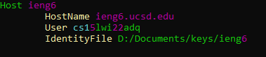
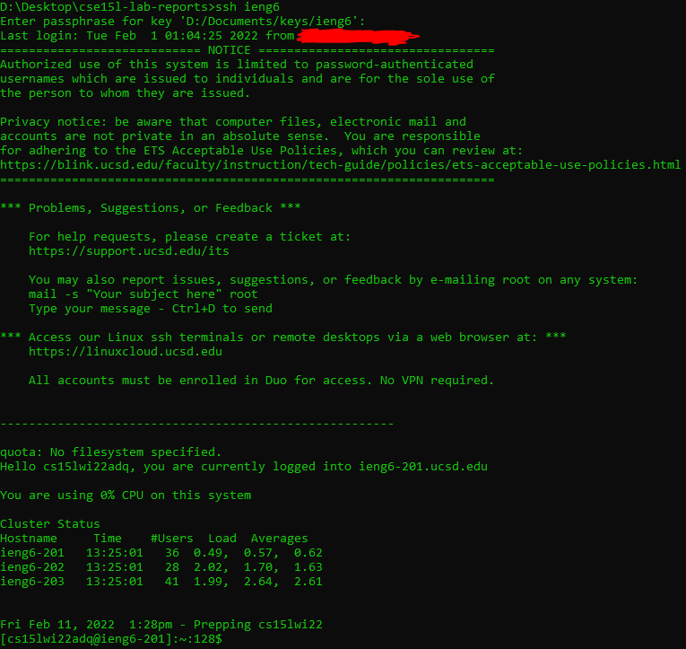
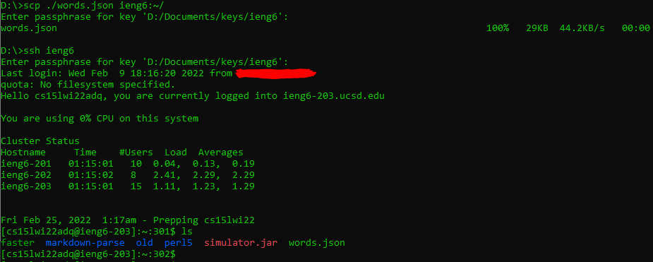

<style>pre{white-space:pre-wrap;} h1 code{font-size: 0.9em; padding: 5px;} code{padding: 3px;color:rgb(250,70,20);}</style>

# Streamlining ssh configuration
While some people use a telnet client like putty to manage their connections, it is actually possible to do effectively the same thing with your default OpenSSH configuration using its config files.
## Editing the config file
Normally an ssh command to log into `ieng6` would look like "`ssh -i identityfile user@ieng6.ucsd.edu`". This command would be simplified using this configuration in the `%userprofile%\.ssh\config` file:
```
Host ieng6
	HostName ieng6.ucsd.edu
	User user
	IdentityFile %userprofile%\.ssh\ieng6_key
```
In my case, the configuration would be this instead:
```
Host ieng6
	HostName ieng6.ucsd.edu
	User cs15lwi22adq
	IdentityFile D:\Documents\keys\ieng6
```
This is because I set up my computer in a strange way.


## Using the config file
Once you've `vim`med your way to victory, you can now log in by typing 
```
ssh ieng6
```
and then typing in the password for your key (which you should have if you want to be secure)



And as quick as a student begins to hate eating at Canyon Vista, you are logged into `ieng6`. You can now pat yourself on the back and revel in the amount of time you'll save (that you'll end up spending on procrastinating on other work).

Oh yeah, almost forgot, but did you know that you can also use your new ssh alias with `scp`? 



By substituting the destination server name with your new alias you can log in in far fewer keystrokes and up arrow mashes than before.
```diff
=== Old and bad ===
- scp -r -i ieng6 ./* cs15lwi22adq@ieng6.ucsd.edu:~/directory

=== New and good (yes this is propaganda) ===
+ scp -r .* ieng6:~/directory

That saves a whole lot of keystrokes if ya ask me (almost half!)
```

Ok now I'm done, go back to touching grass or whatever you kids do nowadays.